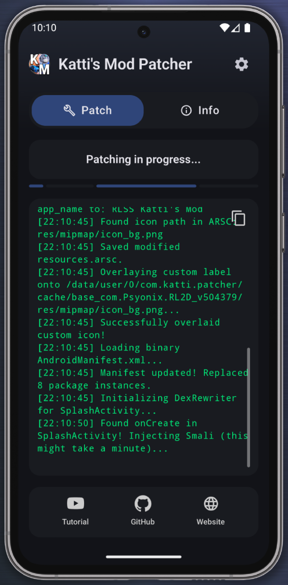

# Katti's Mod Patcher for RLSS

Built for Android 17 or older. Downloads latest release of Katti's Mod for RLSS, patches existing RLSS installaton and creates a new copy.

    

# How to use the app
- Install RLSS through official sources(Epic Store)
- Download and install KM Patcher APK ([link](https://github.com/CKatti/KattisModPatcher/releases/latest/download/KattisMod_Patcher.apk))
- Open the app and press "Start Patch"
- You might need provide "Install from unknown sources" premissions
- Wait till patching is complete and installation prompt appears

In case the patcher gets stuck, try to clear cache/data and try again.

# How to build
- Open repository in Android Studio (built using Quail 3 version)

# Features: 
- Renames package
- Overlays a watermark on original logo
- Injects latest KattisMod lib into APK
- Rewrites .dex file to load custom lib
- Repack, zip align and sign the modded  APK

# License
Code released under the [MIT License](./LICENSE)